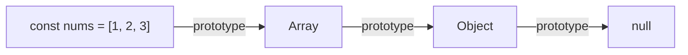

---
{"dg-publish":true,"permalink":"/knowledge/java-script-prototypes/","tags":["javascript","webdevelopement"]}
---

---

From Greek:
- **prōto-** = “first”
- **typos** = “impression, model, pattern, or stamp”

Prototypes are the way inheritance is handled in JavaScript. Every JS Object has a prototype. The prototype again is also set to an Object. => Prototype Chain
The chain ends when a prototype is set to null.



## `__proto__` vs `prototype`

`prototype` is defined on the constructor of an object. `__proto__` is defined on the instance of the object.

```js
function Person(name) {
  this.name = name;
}

const bob = new Person("Bob");

bob.__proto__ === Person.prototype // true
```

